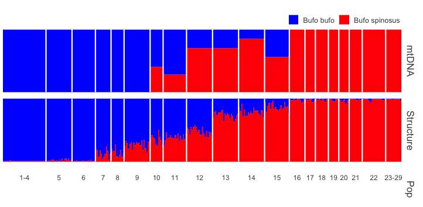

Install the following packages.

For the sequence data manipulation and missingness plotting:
```{r}
library(seqinr)
library(gplots)
library(RColorBrewer)
library(graphics)
```

For the population structure visualisation in pophelper:

```{r}
#For structure mapping:
library(Cairo)
library(ggplot2)
library(gridExtra)
library(gtable)
library(tidyr)
#library(devtools)

Sys.setenv("R_REMOTES_NO_ERRORS_FROM_WARNINGS"=TRUE)
#install pophelper package from GitHub
remotes::install_github('royfrancis/pophelper')
#load library for use
library(pophelper)
```

For the population genetics statistics:

```{r}
library(adegenet)
library(pegas)
```

# FILE FORMATS

## FASTA (`seqinr`)

With the package `seqinr` you can read in a fasta file.
Below you see an example where I used an aligned fasta file with triplicated samples (library in triplicate, treated as separate samples during assembly). I want to know whether these sequences have differences between replicates of individuals, or whether differences could be attritbuted to missing data.

First we read in the data:    

```{r}
original<-read.fasta("RAD_Bufo_replicated_individuals.fasta", as.string=TRUE, set.attributes = FALSE)
```

Now I'm making a for loop to look at differences caused by missing data (- and n), or by alternative genotype calling (c, t, g, a or IUPAC codes)1

First I make empty matrices to fill during the for loop

```{r}
Out_Perc_diff<-matrix(nrow=length(original), ncol=0)
Out_Perc_no_worries<-matrix(nrow=length(original), ncol=0)
```

Then I loop trough the fasta  file

```{r}
for (i in 1:length(original)){
  #Make empty vectors for second loop
  col_diff<-c()
  col_no_worries<-c()
  Seq_1<-getSequence(original[[i]])
  
  for (j in 1:length(original)){
    #Get raw percentage of difference between sequences, includes ALL differences
    Seq_2<-getSequence(original[[j]])
    Same<-sum(Seq_1==Seq_2, na.rm=TRUE)          #All positions which are equal
    Diff<-sum(!Seq_1==Seq_2, na.rm=TRUE)         #All positions which are different
    stopifnot((Same+Diff)==length(Seq_1))        #Check
  
    Perc_diff<-(Diff/length(Seq_1))
    
    #Get percentage of difference because of N
    Seq_1_N<-Seq_1=="n"
    Seq_2_N<-Seq_2=="n"
    
    #Get percentage of difference because of -
    Seq_1_I<-Seq_1=="-"
    Seq_2_I<-Seq_2=="-"
    
    #Get the exceptions, the differences we are not afraid of (missing data: N and -)
    #The - (indel) in paired end is very common when not sequencing the whole selected fragment
    Diff_no_w_1<-sum(!Seq_1_N==Seq_2_N, na.rm=TRUE)
    Diff_no_w_2<-sum(!Seq_1_I==Seq_2_I, na.rm=TRUE)
    Diff_no_w_3<-sum(Seq_1_N==TRUE & Seq_1_N==Seq_2_I | Seq_1_I==TRUE & Seq_1_I==Seq_2_N, na.rm=TRUE)
    
    Perc_no_worries<-(((Diff_no_w_1+Diff_no_w_2)-Diff_no_w_3)/length(Seq_1))
    
    #Add the numbers to make a column
    col_diff<-c(col_diff, Perc_diff)
    col_no_worries<-c(col_no_worries, Perc_no_worries)
  }
  #Add the columns to the matrix
  Out_Perc_diff<-cbind(Out_Perc_diff, col_diff)
  Out_Perc_no_worries<-cbind(Out_Perc_no_worries, col_no_worries)
}
```

Then I add rownames to the matrices, mainly to be able to produce figures.

```{r}
rownames(Out_Perc_diff)<-names(original)
colnames(Out_Perc_diff)<-names(original)
rownames(Out_Perc_no_worries)<-names(original)
colnames(Out_Perc_no_worries)<-names(original)
```

Then I calculate what we came for: the actual number of 'wrongly' called SNPs!

```{r}
Diff_worry<-Out_Perc_diff-Out_Perc_no_worries
```

I order them in an order that I prefer:

```{r}
All_diff<-c(Diff_worry['1572_A','1572_B'], Diff_worry['1572_B','1572_C'],Diff_worry['1572_A','1572_C'],
  Diff_worry['1573_A','1573_B'], Diff_worry['1573_B','1573_C'],Diff_worry['1573_A','1573_C'],
  Diff_worry['1574_A','1574_B'], Diff_worry['1574_B','1574_C'],Diff_worry['1574_A','1574_C'],
  Diff_worry['4112_A','4112_B'], Diff_worry['4112_B','4112_C'],Diff_worry['4112_A','4112_C'],
  Diff_worry['4113_A','4113_B'], Diff_worry['4113_B','4113_C'],Diff_worry['4113_A','4113_C'],
  Diff_worry['4114_A','4114_B'], Diff_worry['4114_B','4114_C'],Diff_worry['4114_A','4114_C']
  )
```  

And then I take the mean of all the differences that worried me!

```{r}
mean(All_diff)
```

Good, we can see that only a very small portion (<1%) of the differences between the replicates of individuals is due to an actually different nucleotide.

Now I want to visualise this with "heat tables" to compare between the influence of real mistakes vs missing data.

First, I made a custom palette to colour my "heat table"

```{r}
my_palette <- colorRampPalette(c("green", "yellow", "red"))(n = 299)
```

And I define the color breaks manually for a "skewed" color transition, because I know some values are not included.

```{r}
col_breaks = c(seq(0,.3,length=100),                 # for green
               seq(0.3001,0.6,length=100),            # for yellow
               seq(.6001,.9,length=100))             # for red
```

And I make Figure 1: to only see the influence of missing data.
First I need to set the dimensions of the "image" I'm creating

```{r}
dim1 <- ncol(Out_Perc_no_worries)
dim2 <- ncol(Diff_worry)
```

Then I make the actual image, give it axes, and fill it with the numbers I calculated above

```{r}
image(1:dim1, 1:dim1, Out_Perc_no_worries, axes = FALSE, xlab="", ylab="", col=my_palette, breaks=col_breaks)+
  axis(1, 1:dim1, colnames(Out_Perc_no_worries), cex.axis = 0.7, las=3)+
  axis(2, 1:dim1, colnames(Out_Perc_no_worries), cex.axis = 0.7, las=1)+
  text(expand.grid(1:dim1, 1:dim1), sprintf("%0.2f", Out_Perc_no_worries), cex=0.54)
```

Why do we observe the two square blocks in the table?

Now we also want to see this figure for the "really concerning" differences between the sequences

```{r}
image(1:dim2, 1:dim2, Diff_worry, axes = FALSE, xlab="", ylab="", col=my_palette, breaks=col_breaks)+
  axis(1, 1:dim2, colnames(Diff_worry), cex.axis = 0.7, las=3)+
  axis(2, 1:dim2, colnames(Diff_worry), cex.axis = 0.7, las=1)+
  text(expand.grid(1:dim2, 1:dim2), sprintf("%0.2f", Diff_worry), cex=0.54)
```

Cool! Compared to figure 1, figure 2 shows really less differences between the replicates between individuals.

There are other packages available, which you can use to explore your data, also for other file formats. We are not going trough all of them, but here are a few examples of packages you can use.

## VCF

### `vcfR`

To read in and manipulate a vcf file, one can use the R package vcfR:
https://cran.r-project.org/web/packages/vcfR/vignettes/intro_to_vcfR.html
    
    
## BAM/SAM 

### `scanBam`

To import, count, index, filter, sort, and merge BAM files:
https://rdrr.io/bioc/Rsamtools/man/scanBam.html
    
### `Rsamtools`

To read in and manipulate a BAM/SAM file, one can use the R package Rsamtools:
https://kasperdanielhansen.github.io/genbioconductor/html/Rsamtools.html
    
# Data filtering 

It is nice to be able to filter your data manually. This allows you to understand better what you are working with. Keep in mind that with large SNP data this is probably not possible. We here will only discuss what to do with smaller datasets. For larger datasets we'll probably set up another session!

Examples of SNPs that you might want to filter out are singletons. Or you might want to work with only the di-allelic SNPs in your dataset, because many softwares only utilise di-allelic SNPs. In my case, I wanted to see which SNPs were present as one variant in one of my species, and as another in another species. With these SNPs I would be able to analyse the hybrids between both species. In the next code, I filtered my data for such 'species specific' SNPs based on my assumed 'pure' populations.

##NOTE: add a map at this point for checking the populations?{>>Map of what?<<}

First I read in my SNPs

```{r}
SNPtable<-as.data.frame(read.table("RAD_Bufo_SNPtable.txt", header=TRUE))
knitr::kable(SNPtable[1:5,1:5])
```

Then I remove columns where one species only has NA (possibly null aleles). I used the maximum amount of individuals with "NA" by using "<=54" and "<=30"

```{r}
SNPtable_1<-SNPtable[,colSums(is.na(SNPtable[1:74,])) <= 54]
SNPtable_2<-SNPtable_1[,colSums(is.na(SNPtable_1[75:114,])) <= 30]
```

Then I check my dimensions

```{r}
nrow(SNPtable_2)
ncol(SNPtable_2)
```

And I split the table up in two tables for each species that I have: B_bufo and B_spino

```{r}
B_bufo<-SNPtable_2[1:74,]
B_spino<-SNPtable_2[75:114,]
```

One final check, are the first columns the right populations?
```{r}
B_bufo[,1]
B_spino[,1]
```

Now I can start comparing the two tables

Again I prepare empty matrices:
#@#@ If you know the  dimantions of the matrix in advance it is better to set it before
```{r}
Not_diagnostic_old<-matrix(NA,nrow=nrow(SNPtable_2), ncol=0)
Diagnostic_old<-matrix(NA,nrow=nrow(SNPtable_2),ncol=0)
Not_diagnostic<-matrix(NA,nrow=nrow(SNPtable_2), ncol=0)
Diagnostic<-matrix(NA,nrow=nrow(SNPtable_2),ncol=0)
```

And now I loop through all SNPs (columns) in this table:

```{r}
for (i in 3:ncol(SNPtable_2)) {
  x_tot<-B_bufo[,i]
  y_tot<-B_spino[,i]
  #compare the two sets of numbers, returns a block with true/false 
  ans<-vapply(x_tot, function(x_tot) x_tot==y_tot, logical(length(y_tot)))
  #if true occurs save in table with not_diagnostic markers
  if(any(ans, na.rm=TRUE)|(all(is.na(y_tot))|all(is.na(x_tot)))){
    Not_diagnostic<-cbind(Not_diagnostic_old, SNPtable_2[,i, drop=FALSE])
    #if only false or NA save in table with diagnostic markers
  } else {
    Diagnostic<-cbind(Diagnostic_old, SNPtable_2[,i, drop=FALSE])
  }
  Not_diagnostic_old<-Not_diagnostic
  Diagnostic_old<-Diagnostic
}
```

Awesome, now I want to summarize and check if all went well!

```{r}
Tot_original<-ncol(SNPtable)-2
Tot_original_B_bufo<-ncol(B_bufo)-2
Tot_original_B_spino<-ncol(B_spino)-2
Tot_not_diagnostic<-ncol(Not_diagnostic_old)
Tot_diagnostic<-ncol(Diagnostic_old)
Tot_not_diagnostic+Tot_diagnostic
Perc_diagnostic<-Tot_diagnostic/Tot_original*100
```

Question: what do the different percentages calculate?

And finally I can write the diagnostic snps to a file:

```{r}
write.table(Diagnostic_old, file="RAD_Bufo_Diagnostic.txt", quote=FALSE, sep=" ", col.names=TRUE)
```

# Questions: 

- How many diagnostic markers do I have?

- How many non-diagnostic markers do I have?

- Does it add up to the total of markers in the input file?

- Where did the other markers go?

### Challenge: 

write a code that takes one SNP per RAD locus randomly
```{r}
#isolate rad names
Uni_names<-unique(gsub("(rad[0-9]+)_.*", "\\1", names(Diagnostic_old)))

#make new table
Diagnostic_random<-matrix(NA,nrow=114, ncol=0)
new<-matrix(NA,nrow=114,ncol=0)

#pick the colums with the names, take one random
for (i in 1:length(Uni_names)){
  selection<-Diagnostic_old[,c(colnames(Diagnostic_old)[grep(Uni_names[i],colnames(Diagnostic_old))]), drop=FALSE]
  new<-selection[,sample(ncol(selection), 1), drop=FALSE]
  Diagnostic_random_new<-cbind(Diagnostic_random,new)
  Diagnostic_random<-Diagnostic_random_new
  }
write.table(Diagnostic_random, file="RAD_Bufo_Diagnostic_Random.txt", quote=FALSE, sep=" ", col.names=TRUE)

```

# STRUCTURE

You can run structure-like analysis in R (includes some nice mapping options): 
http://membres-timc.imag.fr/Olivier.Francois/tutoRstructure.pdf

And:
https://onlinelibrary-wiley-com.naturalis.idm.oclc.org/doi/pdf/10.1111/1755-0998.12559

Or:
https://github.com/Tom-Jenkins/admixture_pie_chart_map_tutorial/blob/master/pie_chart_admixture_map_tutorial.R
  
I love the possibilities with visualisation with Pophelper, but other packages are available.
  
First, lets'read in some data. These are the q scores for the nuclear structure run, and frequencies for mtDNA.  
  
```{r}
#Read in the data
Struct_table<-read.table("Structure_31SNPs_qscores_nuclear.txt", header = TRUE)
Struct_table_mtDNA<-read.table("Structure_31SNPs_qscores_mtDNA.txt", header = TRUE)
```

Now make the data structure appropriate for PopHelper, for each structure run you want to visualise, you need to make a list with the clusters assigned. For example, if want to visualise k=3 for your data, you would need to extend the list with "Cluster3" and the values.

```{r}
Q1<-list(structure_1=data.frame(Cluster1=c(Struct_table[,3]),
                                Cluster2=c(Struct_table[,4])))
Q2<-list(mtDNA=data.frame(Cluster1=c(Struct_table_mtDNA[,3]),
                          Cluster2=c(Struct_table_mtDNA[,4])))
```

Then I make the population labels appropriate for PopHelper

```{r}
Pop_label<-Struct_table[,1, drop = FALSE]
Pop_label$Pop <- as.character(Pop_label$Pop)
```

And I check whether this now includes all my populations I want to visualise:

```{r}
nrow(Pop_label)
```

And the master-piece plot! It is only one line of code!! b(^-^)d

```{r}
plotQ(qlist=c(Q2[1], Q1[1]), imgoutput='join', clustercol=c("blue", "red"), grplab=Pop_label, grplabsize = 1, showlegend=T, divtype= 1, legendlab=c("Bufo bufo","Bufo spinosus"), splab=c("mtDNA", "Structure"), linecol="white", pointtype=NA, grplabpos=1, imgtype="png")

```




Look at the many options available for your population structure plotting in R with the PopHelper package here:
http://www.royfrancis.com/pophelper/articles/index.html#plotq

## Population genetic analyses in `adegenet`

### `adegenet`
Read in the data & replace missing data with the mean frequency (there are other methods available).
Other file formats are possible, but here we use a structure file.

First, we read in the data:
```{r}
obj1<-read.structure("RAD_Bufo_alldata.str",n.ind = 373,n.loc = 4836,col.lab = 1,col.pop = 2,col.others = NA,row.marknames = 0,onerowperind = F)
```

And I check the populations in this new "obj1" to see if I have all my data now:

```{r}
levels(obj1$pop)
```

There is an option to replace missing data with the mean frequency:

```{r}
NA_mean<-tab(obj1, NA.method="mean")
```

## Linkage Disequilibrium (LD)
 {>>Add some more explanation about what that means and what we are calculating here<<}
```{r}
##LD2 is for unphased data, LD is for phased data
data(jaguar)
LD2(jaguar, details = FALSE)
#@#@ This doesn't work for me. It seems like LD2 needs a loci matrix
#LD2(obj1, details = FALSE)
#doesn't seem to work for my own data:
#obj_p1_11<-as.loci(obj1[obj1$pop=="T1_11",1:100])
#LD(obj_p1_11)
```

## Hardy Weinberg equilibrium

If you want to know whether your data is out of Hardy Weinberg equilibrium, one can do this with adegenet too:

For example, we can do the Hardy Weinberg test without the Monte Carlo test, for population 11:

```{r}
Test_pop_T1_11<-hw.test(obj1[obj1$pop=="T1_11",1:100], B=0)
```

And we can check the output:

```{r}
Test_pop_T1_11
```

### Questions:

- Why do we have rows with no output?

- Why do we have only 43 loci?
  
  
## Principal Component Analysis

We can also perform a PCA with adegenet:

```{r}
pca1<-dudi.pca(NA_mean, scannf=F, scale=F,nf=3)
```

And we make a nice plot:

```{r}
s.class(pca1$li, pop(obj1), axesel=FALSE, cstar=1, cpoint=1, col=c(rep("black", 7),
                                                                   rep("blue", 4), 
                                                                   rep("black", 2), 
                                                                   rep("red", 5), "blue", 
                                                                   "black", "black",
                                                                   rep("black", 12)))
```

This looks good.

What is the variance explained per axis?

```{r}
summary(pca1)
```

Adegenet has many other options: 

  DAPC & Compoplot
  With adegenet:
  http://adegenet.r-forge.r-project.org/files/tutorial-dapc.pdf

## THE END HAPPY CODING!!
